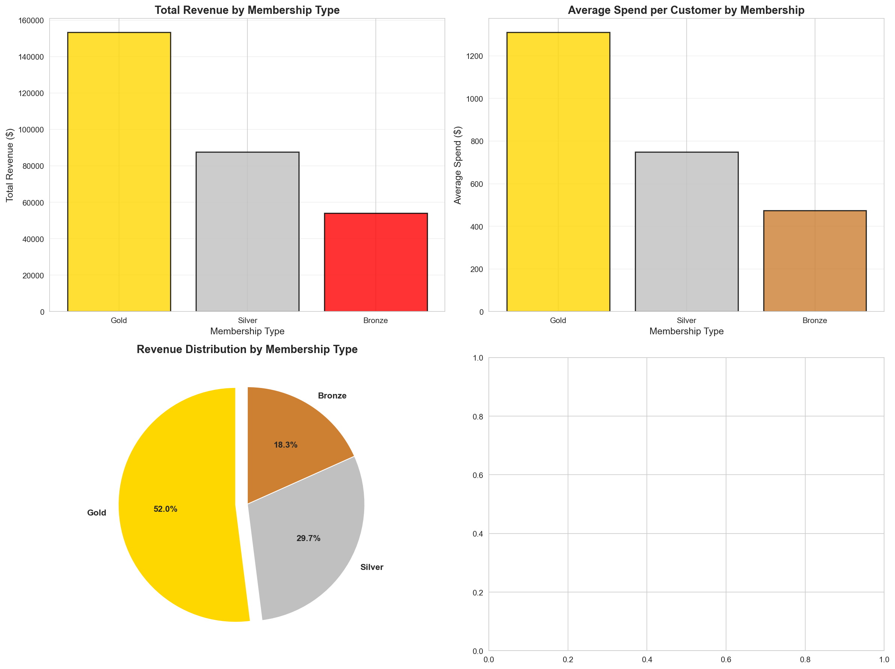
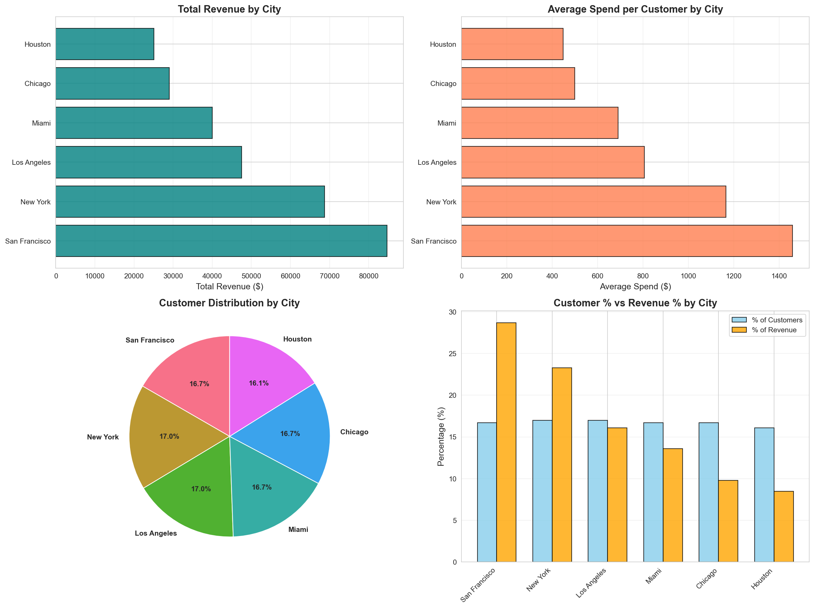

# E-Commerce Customer Analytics & Revenue Insights

**End-to-end data analysis project revealing customer behavior patterns, revenue drivers, and actionable business recommendations**


---

## Project Overview

This project analyzes **350 e-commerce customers** to uncover revenue optimization opportunities and customer behavior patterns. Through comprehensive data analysis, I identified over **$30,000 in annual revenue growth potential** through targeted initiatives.

**Key Achievement:** Discovered that 10% of customers generate 17.1% of revenue, with 100% concentration in Gold membership tier and San Francisco location - highlighting critical business risks and opportunities.

---

## Business Problem

The company needed to understand:
- Which customer segments drive revenue
- What factors predict high spending
- Where revenue concentration risks exist
- How to optimize customer satisfaction
- Which marketing levers to pull for growth

---

## Key Findings

### 1. Revenue Concentration Risk
- **Gold members** generate **52% of total revenue** ($153,404) but represent only 33% of customers
- Gold members spend **2.8x more** than Bronze members ($1,311 vs $474)
- **Critical Risk:** Revenue heavily dependent on single customer tier

**Business Impact:** Need immediate Gold retention program and Bronze upgrade strategy

---

### 2. Geographic Performance Disparity
- **San Francisco** customers spend **$1,460 average** (28.7% of total revenue)
- **Houston** customers spend only **$448 average** (8.5% of revenue)
- **3.3x spending difference** between top and bottom cities

**Business Impact:** Massive opportunity to replicate San Francisco success in underperforming markets

---

### 3. VIP Customer Identification
- **Top 10%** of customers (34 people) generate **17.1% of revenue** ($50,517)
- **100% are Gold members** in San Francisco
- Average satisfaction: **4.86/5.0** (highest of all segments)
- Average purchase volume: **20.7 items** per customer

**Business Impact:** These 34 customers are worth $1,486 each - cannot afford to lose them

---

### 4. Satisfaction-Revenue Correlation
- Strong positive correlation between satisfaction and spending
- Satisfied customers spend significantly more than unsatisfied customers
- Customer experience improvements have **measurable ROI**

**Business Impact:** CX investments directly drive revenue growth

---

### 5. Bronze Member Opportunity
- **114 Bronze customers** (32.6%) generate only **18.3% of revenue**
- Average Bronze spend: **$474** (potential to reach $748+ with Silver upgrade)
- **$96,000 untapped revenue** if Bronze customers upgraded to higher tiers

**Business Impact:** Massive conversion opportunity with existing customer base

---

## Actionable Recommendations

### Priority 1: VIP Protection Program (URGENT)
**Problem:** 34 VIP customers = $50,517 revenue (17.1% of total) at risk

**Action:**
- Implement dedicated account managers
- Exclusive perks and early access
- Quarterly relationship check-ins
- Birthday rewards and personalized offers

**Investment:** $2,500/year  
**Risk Mitigation:** Protects $50,517 revenue  
**ROI:** 1,920% (insurance against churn)

---

### Priority 2: Bronze-to-Silver Upgrade Campaign
**Opportunity:** 114 Bronze customers averaging $474 spend

**Action:**
- Target top 30% of Bronze customers (34 people)
- Offer 90-day Silver trial with full benefits
- Expected conversion rate: 20% (7 customers)

**Financial Impact:**
- Revenue increase: **+$1,918/year**
- Campaign cost: $500
- **ROI: 284%**
- **Payback period: 3 months**

---

### Priority 3: Geographic Expansion Strategy
**Finding:** San Francisco generates 3.3x more revenue per customer than Houston

**Action:**
- Investigate San Francisco success factors
- Apply learnings to underperforming cities
- Focus on Houston, Chicago, and Miami

**Potential Impact:**
- Bringing Houston to 75% of SF performance = **+$28,000 annual revenue**
- Investment: $5,000 (market research + targeted campaigns)
- **ROI: 460%**

---

### Combined Revenue Opportunity

| Initiative | Revenue Impact | Investment | Net Gain | ROI |
|------------|----------------|------------|----------|-----|
| VIP Protection | $50,517 protected | $2,500 | Risk mitigation | 1,920% |
| Bronze Upgrade | +$1,918 | $500 | +$1,418 | 284% |
| Geographic Optimization | +$28,000 | $5,000 | +$23,000 | 460% |
| **TOTAL** | **+$29,918** | **$8,000** | **+$21,918** | **274%** |

**Total Potential Revenue Growth: 10.1%**

---

## Technical Approach

### Tools & Technologies
- **Python 3.9+** - Core programming language
- **Pandas** - Data manipulation and analysis
- **NumPy** - Numerical computations
- **Matplotlib & Seaborn** - Data visualization
- **Jupyter Notebook** - Interactive analysis environment

### Analysis Methodology
1. **Data Exploration** - Structure analysis, quality assessment, pattern identification
2. **Data Cleaning** - Type optimization, validation, preparation
3. **Revenue Analysis** - Segmentation, geographic patterns, VIP identification
4. **Correlation Analysis** - Spending drivers, satisfaction factors, relationship discovery

---

## Project Structure
```
E-Commerce-Customer-Analytics/
│
├── data/
│   ├── raw/                          # Original dataset
│   └── processed/                    # Cleaned, analysis-ready data
│
├── notebooks/                        # Analysis notebooks
│   ├── 01_data_exploration.ipynb    # Initial data investigation
│   ├── 02_data_cleaning.ipynb       # Data preparation
│   ├── 03_revenue_analysis.ipynb    # Revenue deep dive
│   └── 05_correlation_analysis.ipynb # Relationship analysis
│
├── reports/
│   └── figures/                      # Generated visualizations
│
├── src/                              # Reusable code modules
│   ├── data/                         # Data processing functions
│   ├── visualization/                # Plotting utilities
│   └── analysis/                     # Analysis functions
│
├── requirements.txt                  # Python dependencies
└── README.md                         # This file
```

---

## Key Visualizations

### Revenue by Membership Type


**Insight:** Gold members generate over half of all revenue despite being only one-third of customer base.

---

### Geographic Revenue Performance

**Insight:** 3.3x spending difference between San Francisco and Houston reveals geographic opportunity.

---

### High-Value Customer Analysis
reports/figures/11_high_value_customers.png

**Insight:** Top 10% of customers generate 17.1% of revenue - clear VIP segment.

---

### Correlation Matrix
reports/figures/13_correlation_matrix.png

**Insight:** Satisfaction, membership tier, and items purchased are strongest revenue drivers.

---

## Dataset Information

**Source:** E-commerce customer transaction database  
**Size:** 350 customers, 11 features  
**Time Period:** [Add if known]  
**Data Quality:** 100% complete, no missing values, no duplicates

**Features:**
- Customer demographics (age, gender, city)
- Purchase behavior (total spend, items purchased, days since last purchase)
- Membership information (Bronze, Silver, Gold tiers)
- Satisfaction metrics (rating, satisfaction level)
- Promotional data (discount usage)

---

## Installation & Usage

### Prerequisites
```bash
Python 3.9 or higher
pip package manager
```

### Setup Instructions

1. **Clone the repository**
```bash
git clone https://github.com/suzzzel5/E-Commerce-Customer-Analytics.git
cd E-Commerce-Customer-Analytics
```

2. **Create virtual environment**
```bash
python -m venv venv

# Windows
venv\Scripts\activate

# Mac/Linux
source venv/bin/activate
```

3. **Install dependencies**
```bash
pip install -r requirements.txt
```

4. **Launch Jupyter Notebook**
```bash
jupyter notebook
```

5. **Start with** `notebooks/01_data_exploration.ipynb`

---

## Skills Demonstrated

**Technical Skills:**
- Data cleaning and preprocessing
- Exploratory data analysis (EDA)
- Statistical analysis and correlation
- Data visualization and storytelling
- Python programming (Pandas, NumPy, Matplotlib, Seaborn)

**Business Skills:**
- Revenue analysis and optimization
- Customer segmentation
- Risk identification
- ROI calculation
- Strategic recommendation development
- Executive communication

**Analytical Thinking:**
- Problem identification
- Hypothesis testing
- Pattern recognition
- Insight extraction
- Decision framework creation

---

## Key Learnings

1. **Revenue concentration** creates both risk and opportunity
2. **Geographic patterns** reveal untapped market potential  
3. **Customer satisfaction** directly correlates with spending behavior
4. **Top 10% of customers** disproportionately drive revenue
5. **Data-driven recommendations** require ROI justification for business buy-in

---

Data Analyst | Business Intelligence | Python Developer

- GitHub: [@suzzzel5](https://github.com/suzzzel5)
- LinkedIn: (https://www.linkedin.com/in/sujal-maharjan-635675251/)
- Email: maharjansujal@gmail.com


---

## Acknowledgments

- Dataset source: [kaggle.com]
- Inspired by real-world business analytics challenges
- Thanks to the data science community for continuous learning resources

---

## License

This project is licensed under the MIT License - see the [LICENSE](LICENSE) file for details.

---

**Star this repository if you found it helpful!**

*Last Updated: 4th march *